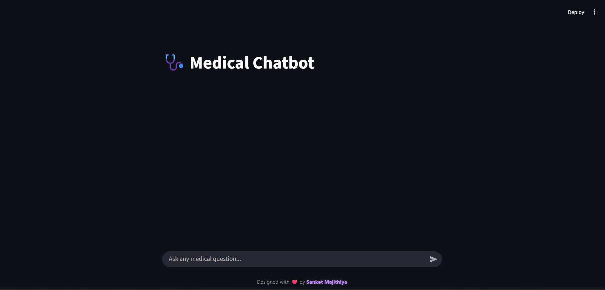

# 🩺 Medical Chatbot

An interactive AI-powered chatbot built with Streamlit, LangChain, ChromaDB, and HuggingFace Embeddings. This application allows users to ask medical questions and get responses based on embedded medical PDFs.

---

## 🧠 Features

- Natural language interaction with AI
- Vector-based document retrieval using ChromaDB
- PDF loader and text chunking
- Embeddings using `sentence-transformers/all-mpnet-base-v2`
- Beautiful UI with Streamlit and persistent chat history
- Dockerized for easy deployment

---

## 🛠️ Tech Stack

- Python 3.10
- [Streamlit](https://streamlit.io/)
- [LangChain](https://www.langchain.com/)
- [ChromaDB](https://www.trychroma.com/)
- [HuggingFace Embeddings](https://huggingface.co/)
- [Docker](https://www.docker.com/)
- [PyPDF Loader](https://python.langchain.com/docs/integrations/document_loaders/pdf)

---

# 🚀 Getting Started
# Option 1: Run via Docker (Recommended)

Make sure Docker is installed.

# Build the image
docker build -t medical-chatbot .

# Run the container
docker run -p 8501:8501 medical-chatbot

# Visit: http://localhost:8501

# Option 2: Run Locally Without Docker:

1. Clone the Repository
git clone https://github.com/your-username/medical-chatbot.git
cd medical-chatbot

2. Create Virtual Environment
python -m venv env
# On Windows: env\Scripts\activate
On linux:     source env/bin/activate

3. Install Dependencies
pip install -r requirements.txt

4. Run the App
streamlit run app.py

📄 .env File
Create a .env file in the root directory (if needed) to store API keys or environment settings.

Example: OPENAI_API_KEY=your-api-key-here

