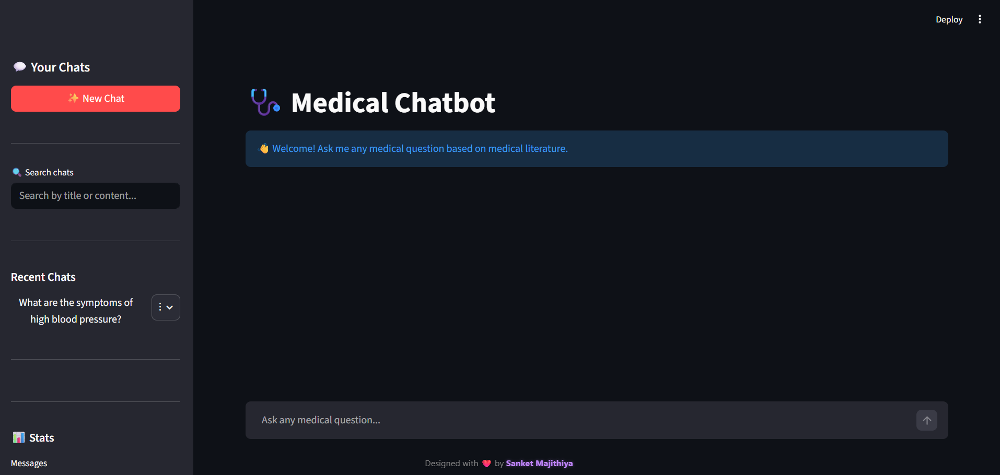
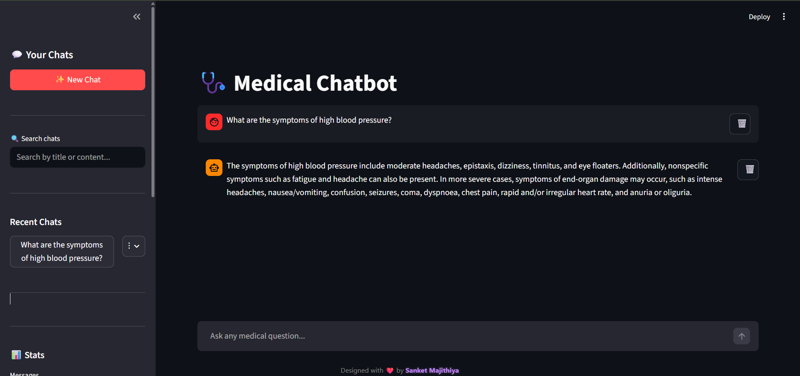
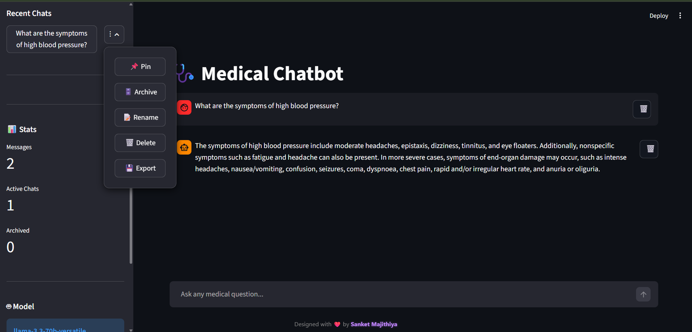

# 🩺 Medical Chatbot

An AI-powered medical information chatbot built with Streamlit, LangChain, and Groq's lightning-fast LLM API. Ask questions about medical conditions, symptoms, treatments, and health topics - all backed by trusted medical literature.





---

## 🧠 Features

### Core Functionality
- 🤖 **AI-powered medical Q&A** using Groq's Llama 3.3 70B model
- 📚 **Vector-based document retrieval** with ChromaDB
- 🔍 **Semantic search** through medical literature
- ⚡ **Lightning-fast responses** powered by Groq API (FREE!)

### Chat Management (ChatGPT-Style)
- 💬 **Multi-session chat history** - All conversations auto-saved locally
- 📌 **Pin important chats** - Keep frequently-used conversations at the top
- 🔍 **Search all chats** - Find past conversations by title or content
- 🗄️ **Archive old chats** - Organize hundreds of chats easily
- 📝 **Rename & export chats** - Download conversations as text files
- 🗑️ **Delete individual messages** - Fine-tune your chat history

### Technical Features
- 📖 PDF document processing with fallback parsers
- 🧠 HuggingFace embeddings (`sentence-transformers/all-mpnet-base-v2`)
- 💾 Persistent local chat storage (JSON-based)
- 🎨 Clean, modern dark-mode UI

---

## 🛠️ Tech Stack

- **Python** 3.10+
- **[Streamlit](https://streamlit.io/)** - Web UI framework
- **[LangChain](https://www.langchain.com/)** - LLM orchestration
- **[Groq](https://groq.com/)** - Ultra-fast LLM inference with FREE API
  - Model: `llama-3.3-70b-versatile`
- **[ChromaDB](https://www.trychroma.com/)** - Vector database for embeddings
- **[HuggingFace](https://huggingface.co/)** - Sentence transformer embeddings
- **PyPDF** - PDF parsing with fallback support

---

## 🔑 API Key Setup

This app uses **Groq API** for lightning-fast LLM inference (100% FREE with generous limits!).

### Get Your Groq API Key

1. Visit: **https://console.groq.com/keys**
2. Sign up for a free account
3. Click "Create API Key"
4. Copy the key (starts with `gsk_`)

### Official Groq Resources

- 🏠 **Homepage:** https://groq.com/
- 📚 **Documentation:** https://console.groq.com/docs
- 🔑 **API Keys:** https://console.groq.com/keys
- 🤖 **Available Models:** https://console.groq.com/docs/models
- ⚡ **Why Groq?** Ultra-fast inference speed, generous free tier, no credit card required

### Configure API Key

**For Local Development:**

1. Create a `.env` file in the project root
2. Add the following:
   ```env
   GROQ_API_KEY=your_groq_api_key_here
   GROQ_MODEL=llama-3.3-70b-versatile
   TEMPERATURE=0.3
   ```

**For Streamlit Cloud / Hugging Face Spaces Deployment:**

1. Go to your app's settings
2. Navigate to **"Variables and secrets"** (Hugging Face) or **"Secrets"** (Streamlit)
3. Add the following:
   ```toml
   GROQ_API_KEY = "your_groq_api_key_here"
   GROQ_MODEL = "llama-3.3-70b-versatile"
   TEMPERATURE = "0.3"
   ```

---

## 🚀 Getting Started

### Option 1: Run Locally

1. **Clone the Repository**
   ```bash
   git clone https://github.com/your-username/medical-chatbot.git
   cd medical-chatbot
   ```

2. **Create Virtual Environment**
   ```bash
   python -m venv env
   # On Windows:
   env\Scripts\activate
   # On Linux/Mac:
   source env/bin/activate
   ```

3. **Install Dependencies**
   ```bash
   pip install -r requirements.txt
   ```

4. **Set Up Environment Variables**
   - Create `.env` file (see API Key Setup above)

5. **Run the App**
   ```bash
   streamlit run app.py
   ```

6. **Open in Browser**
   - Visit: http://localhost:8501

---

### Option 2: Deploy to Streamlit Cloud (Recommended)

1. **Push to GitHub**
   ```bash
   git add .
   git commit -m "Ready for deployment"
   git push origin main
   ```

2. **Deploy on Streamlit Cloud**
   - Visit: https://share.streamlit.io/
   - Click **"New app"**
   - Select your GitHub repository
   - Set main file path: `app.py`
   - Add your secrets (see API Key Setup above)
   - Click **"Deploy"**!

3. **Your app will be live at:**
   ```
   https://[your-app-name].streamlit.app
   ```

---

### Option 3: Run via Docker

Make sure Docker is installed.

1. **Build the Docker Image**
   ```bash
   docker build -t medical-chatbot .
   ```

2. **Run the Container**
   ```bash
   docker run -p 8501:8501 medical-chatbot
   ```

3. **Visit:** http://localhost:8501

---

## 📁 Project Structure

```
medical-chatbot/
├── app.py                 # Main Streamlit application
├── chatbot.py             # Chatbot response logic
├── chat_manager.py        # Chat session management (save/load/archive)
├── vector.py              # PDF processing & vector database setup
├── requirements.txt       # Python dependencies
├── .env                   # Environment variables (API keys)
├── medical_books/         # PDF medical literature
├── medical_chromadb/      # ChromaDB vector database
├── saved_chats/           # Saved chat sessions (JSON)
└── assets/                # Screenshots and images
```

---

## 🎯 Usage

1. **Ask Medical Questions**
   - Type any health-related question
   - Get AI-powered answers based on medical literature

2. **Manage Your Chats**
   - Click **"New Chat"** to start fresh
   - Use **⋮ menu** to Pin, Archive, Rename, or Delete chats
   - Use **Search** to find past conversations

3. **Organize Chat History**
   - **Pin** important chats for quick access
   - **Archive** old chats to keep sidebar clean
   - **Export** chats as text files for backup

---

## ⚙️ Environment Variables

Required environment variables (set in `.env` or Streamlit Secrets):

| Variable | Description | Example |
|----------|-------------|---------|
| `OPENAI_API_BASE` | Groq API endpoint | `https://api.groq.com/openai/v1` |
| `OPENAI_API_KEY` | Your Groq API key | `gsk_...` |
| `GROQ_MODEL` | LLM model name | `llama-3.3-70b-versatile` |
| `TEMPERATURE` | Response randomness (0-1) | `0.3` |

---

## 🔒 Important Notes

- ✅ **Powered by trusted medical literature and AI**
- 💡 **Use this for quick health insights and learning**
- 🔐 Your chat history is stored locally for privacy
- 🚀 Groq API provides FREE ultra-fast inference

---

## 📝 License

This project is licensed under the MIT License.

---

## 👨‍💻 Author

**Sanket Majithiya**

---

## 🙏 Acknowledgments

- [Groq](https://groq.com/) for providing free, ultra-fast LLM inference
- [Streamlit](https://streamlit.io/) for the amazing web framework
- [LangChain](https://www.langchain.com/) for LLM orchestration tools
- [ChromaDB](https://www.trychroma.com/) for vector database capabilities
